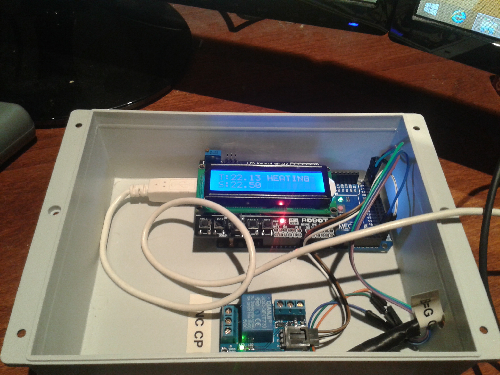

Arduino PID for controlling heating and cooling
=========

Arduino PID that works for both cooling and heating. Cooling features a compressor delay to prevent 
damaging the cooling unit.

Library used [EEPROMEx] (https://github.com/thijse/Arduino-Libraries/tree/master/EEPROMEx)

What you need?  
1. Arduino Mega 
2. Arduino lcd keypad shield.  
3. DS18S20 
4. Relay

Using it:

T: Means temperature now. Celsius
S: Selected temperature.  
Up or Down button controls the selected temperature.
Right arrow controlls heating/cooling mode.